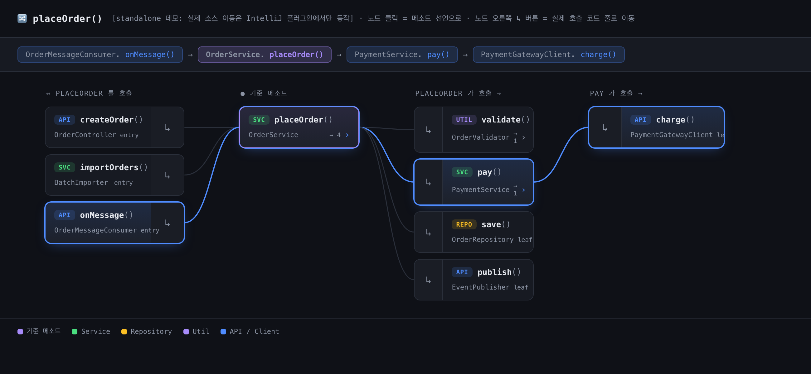

# Call Flow for IntelliJ

선택한 메소드를 기준으로 **호출(callee)** 과 **피호출(caller)** 관계를 한눈에 보여주는 IntelliJ 플러그인입니다. **Kotlin / Java** 를 지원합니다.



## 한눈에 이해하기

위 화면은 `OrderService.placeOrder()` 를 기준으로 분석한 모습입니다. **기준 메소드를 가운데** 두고 좌우로 호출 관계가 펼쳐집니다.

```
   ← 피호출(caller)              ● 기준 메소드 →               호출(callee) →
  누가 이 메소드를 부르는가          분석 대상              이 메소드가 무엇을 부르는가
```

| 화면 요소 | 의미 |
|-----------|------|
| **가운데 보라색 노드** | 분석 기준 메소드 (`placeOrder`) |
| **왼쪽 컬럼들** | 이 메소드를 **호출하는** 쪽 (caller) — `createOrder`, `importOrders`, `onMessage` 등 진입점 |
| **오른쪽 컬럼들** | 이 메소드가 **호출하는** 쪽 (callee) — `validate`, `pay`, `save`, `publish` |
| **곡선** | 호출 관계. 파란 선은 현재 선택된 경로 |
| **상단 경로(breadcrumb)** | 펼친 호출 흐름: `onMessage() → placeOrder() → pay() → charge()` |
| **노드 색상 뱃지** | `API`(Controller/Client) · `SVC`(Service) · `REPO`(Repository) · `UTIL` |
| **노드 안쪽 ↳ 버튼** | 그 호출이 일어나는 **실제 코드 줄**로 이동 (아래 참고) |

### 노드 하나의 두 영역

각 노드는 좌/우로 나뉘어 클릭 동작이 다릅니다.

```
┌─────────────────────────┬──────┐
│  [SVC] pay()            │      │   ← 왼쪽(넓은 영역): 메소드 선언으로 이동
│  PaymentService    → 1  │  ↳   │      + 그 방향으로 한 단계 더 펼치기
└─────────────────────────┴──────┘   ← ↳ 버튼: 실제 호출 코드 줄(call-site)로 이동
```

> UI 는 IDE 내장 브라우저(JCEF)에 HTML/CSS/JS 로 렌더링되며, 호출 관계는 PSI 로 분석해 주입합니다.
> 직접 둘러보려면 `examples/demo.html` 을 브라우저로 열어보세요
> (standalone 데모이므로 실제 소스 이동은 플러그인에서만 동작합니다).

## 사용법

1. 에디터에서 분석할 **메소드 본문 안에 커서**를 둡니다.
2. 우클릭 → **Show Call Flow** (또는 `Ctrl+Alt+F`).
3. 하단 **Call Flow** 툴윈도우에 관계도가 표시됩니다.
   - **노드 왼쪽 영역** 클릭 → 메소드 선언으로 이동 + 그 방향으로 한 단계 더 펼치기
   - **노드의 ↳ 버튼** 클릭 → 실제 호출 코드 줄(call-site)로 이동
   - **점선 테두리 · `⋯ 더보기` 노드** 클릭 → 그 메소드를 그 자리에서 더 분석해
     가지를 이어붙임 (**무한 드릴다운** — 중심은 그대로, 호출 사슬을 원하는 만큼 따라감)

## 빌드 & 실행

```bash
# 샌드박스 IDE 로 실행 (최초 1회 IntelliJ SDK 다운로드)
./gradlew runIde

# 배포용 zip 빌드 → build/distributions/*.zip
./gradlew buildPlugin
```

빌드한 zip 은 IntelliJ → **Settings → Plugins → ⚙ → Install Plugin from Disk…** 로 설치할 수 있습니다.

## 구조

```
src/main/kotlin/com/methodflow/
  ShowCallFlowAction.kt         에디터 우클릭 액션 (Ctrl+Alt+F) — 커서 위치 메소드 탐지
  CallGraphAnalyzer.kt          PSI 분석: callee(본문 호출식) + caller(ReferencesSearch),
                                노드 선언 위치 + 호출선(call-site) 위치 수집
  CallFlowPanelService.kt       분석 JSON 을 HTML 에 주입, 노드/호출선 → 소스 이동
  CallFlowToolWindowFactory.kt  JCEF 웹뷰 툴윈도우 + JS↔Kotlin 브리지(JBCefJSQuery)
src/main/resources/
  META-INF/plugin.xml           액션 / 툴윈도우 / 의존성 선언
  web/callflow.html             그래프 UI (그래프·기준 메소드는 플레이스홀더로 주입)
examples/
  demo.html                     샘플 데이터로 채운 standalone 미리보기
```

### 분석 방식 (경량 PSI 휴리스틱)

- **callee**: 메소드 본문의 호출식을 PSI 로 수집한 뒤 `reference.resolve()` 로 선언을 찾습니다.
  전체 타입 추론은 하지 않으므로 일부 확장함수/제네릭은 이름만 잡힐 수 있습니다.
- **caller**: `ReferencesSearch` 로 IDE 인덱스를 그대로 활용합니다(정확).
- 기준 메소드에서 양방향 **2단계**까지 먼저 BFS, 노드당 최대 **14가지**
  (`CallGraphAnalyzer.MAX_DEPTH`, `MAX_CHILDREN` 으로 조절).
- 그 너머는 **무한 드릴다운**: frontier 노드를 클릭하면 `expandFrom()` 으로 한 단계씩
  추가 분석해 그래프에 병합합니다(JCEF 요청-응답 브리지 `JBCefJSQuery`).

## 요구 사항

- IntelliJ IDEA **2024.2+** (JCEF 포함 JetBrains Runtime)
- JDK 17

> `runIde` 실행 시 `GradleJvmSupportMatrix ... IllegalArgumentException` 가 보이면,
> 대상 플랫폼의 구버전 JVM 호환성 파서가 최신 JDK(예: 25) 표기를 인식하지 못해 발생하는
> IDE 측 경고입니다. 플러그인 동작과는 무관하며, `build.gradle.kts` 의 대상 IDE 버전을
> 올리면 사라집니다.

## 로드맵

- [x] **무한 드릴다운** — frontier 노드 클릭 시 JCEF 브리지로 한 단계 더 분석해 이어붙임
- [ ] 정확도 강화: Kotlin **Analysis API(K2)** 로 수신자 타입까지 해석
- [ ] 깊이/필터(라이브러리 제외, 패키지 한정) 설정 UI

## License

MIT
